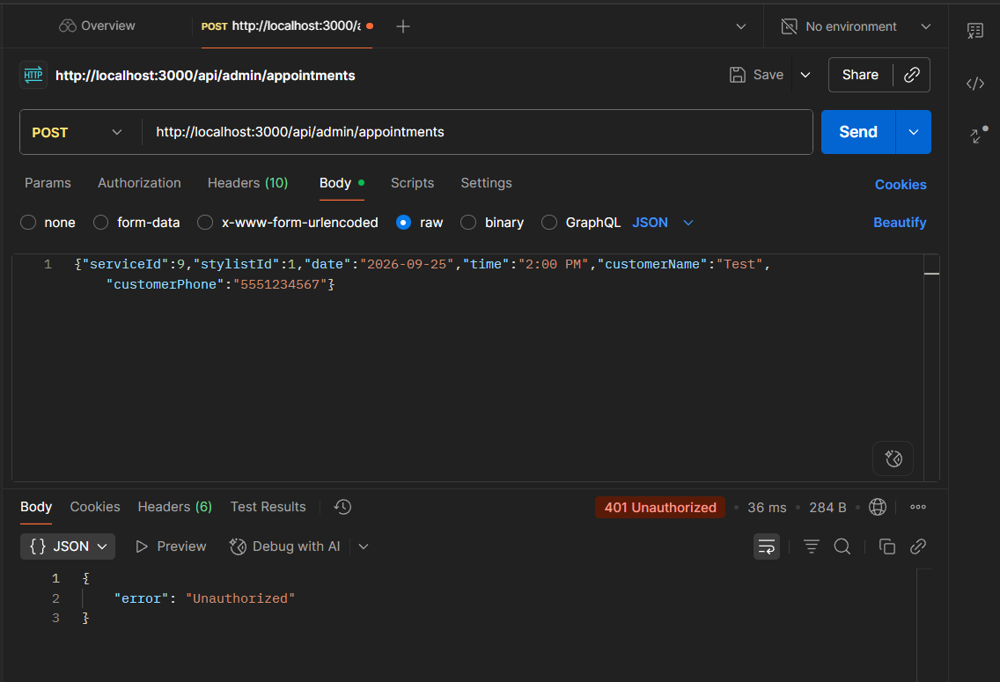

# Manual Appointment API and Data Model

**DT-460 · Manual appointment API and data model**

What changed across three commits, where each change lives, and what's still needed from
everyone else before a customer-facing form can use this.

`branch DT-460/ManualBookingFlow` · `3 commits` · `3 subtasks`

---

## What was asked for

| Subtask | Goal |
| --- | --- |
| **DT-461** | Let the database store the assigned stylist and whether a booking was made online or entered manually by staff. |
| **DT-462** | A secure API that validates submitted info and saves a manual appointment. |
| **DT-464** | Check the stylist's availability first, so manual entries can't double-book or land on blocked time. |

All three are done. Nothing in the admin UI calls this endpoint yet — that's a separate task
(see "What's left" below).

---

## DT-461 — Schema change

`prisma/schema.prisma`, `prisma/seed.js`, one migration.

- `Appointment` gained `stylistId` (optional, FK to `Stylist`, `ON DELETE SET NULL`) and
  `source` (free-text, `"online"` or `"manual"`, default `"online"` so existing rows are
  unaffected).
- New migration: `prisma/migrations/20260912205936_add_stylist_and_source_to_appointment/`.
  Additive only — `ADD COLUMN` and a nullable foreign key — so it preserves every existing
  appointment row.
- `prisma/seed.js` demo appointments now assign a stylist (a few deliberately left
  unassigned) and a `source`, so both new fields have real example data.
- New `lib/appointmentSource.ts` — mirrors `lib/appointmentStatus.ts`'s pattern
  (`ONLINE_SOURCE`/`MANUAL_SOURCE` constants + a couple of small helpers) rather than
  comparing raw strings around the codebase.

**A shared-database snag, also fixed here:** running the migration hit drift — the live dev
database already had `BusinessHour`, `SchedulingRule`, and an untracked `Stylist` table, from
migrations that were run against the shared database but never committed to git. Rather than
`prisma migrate reset` (which would have wiped everyone's data), the missing migration was
reconstructed from the live schema and the untracked ones were marked applied via
`prisma migrate resolve`. No data was touched — see the placeholder note below for what's still
loose here.

## DT-462 — The endpoint

`app/api/admin/appointments/route.ts` (added `POST`, existing `GET` untouched),
new `lib/validations/manualAppointment.ts`.

- `POST /api/admin/appointments` takes one service, an optional stylist, date/time, customer
  contact info, notes, and an optional status (defaults to `confirmed`, since staff are
  entering an already-decided booking, unlike the customer flow's `pending`).
- Validated with Zod (`manualAppointmentSchema`), same style as the existing
  `bookingRequestSchema` for the customer flow, just single-service instead of an array.
- Service and stylist are re-checked against the database (must exist and be active) before
  anything is written.
- `endTime` is computed server-side from the service's `durationMinutes` — never trusted from
  the client.

## DT-464 — Conflict checking

Same file, added on top of DT-462.

- Blocked time (`AvailabilityBlock`) always conflicts, regardless of stylist. An appointment
  only conflicts if it's the *same* stylist and the time ranges overlap — a different stylist
  at the same time is fine. No stylist assigned → only blocked time is checked.
- Cancelled appointments are ignored (reuses `isCancelled` from `lib/appointmentStatus.ts`).
- The conflict check and the `create` run inside one **serializable** Prisma transaction, so
  two near-simultaneous requests for the same stylist and time can't both slip through — one
  gets a write-conflict error, which is returned as the same `409`.
- Any conflict returns `409` with no row created.

---

## Placeholders — not finished, just unblocked

Two things were added that are intentionally incomplete, so the rest of the team isn't
blocked waiting on other stories:

- **`lib/adminAuth.ts`** — `requireAdmin()` only checks that the `adminAccessToken` cookie is
  present, the same shallow check `middleware.ts` already does. It does **not** verify the
  token against Supabase. Every route in this branch calls it the same way
  (`const unauthorized = requireAdmin(request); if (unauthorized) return unauthorized;`), so
  swapping the body of that one function for a real session check is all that's needed later —
  **this is Mohamed's piece.**
- **`BusinessHour` and `SchedulingRule` models in `prisma/schema.prisma`** — declared to match
  what's already live on the shared dev database from in-progress work on persisted business
  hours and scheduling rules, purely so `prisma migrate dev` isn't stuck on drift for anyone
  else. Field names/shape may still change — **this is Swechha's story to refine.**

---

## Verified

Tested against the real dev database with the server running locally (`npm run dev`),
using Postman:

- No `Cookie` header → `401`
- Cookie present, invalid fields (bad date, empty name, short phone) → `400` with per-field
  errors
- Valid request → `201`, appointment created with `source: "manual"`
- Same stylist, overlapping time → `409`
- Different stylist, same time → `201` (correctly not a conflict)
- Cancelled appointment at that time → ignored, rebooking succeeds
- Blocked time, no stylist assigned → `409`

All test rows were deleted afterward — none of the above are sitting in the shared database.

*A request with no `adminAccessToken` cookie, correctly rejected before any validation or
database work happens.*

---

## What's left, by owner

- **Mohamed (P5-S1, admin auth):** replace `lib/adminAuth.ts`'s cookie-presence check with a
  real verified Supabase session. Every route that already calls `requireAdmin()` — including
  the two endpoints in this branch — picks up the fix automatically once that one function is
  correct.
- **Swechha (P5-S7, availability rules):** the `BusinessHour`/`SchedulingRule` models here are
  a placeholder matching what's already live on the shared dev database. Her actual task is
  the authenticated read/write API for them, and pointing the availability-calculation routes
  at persisted data instead of the hardcoded defaults. If her real schema differs from the
  placeholder, whichever of us merges second should rebase and adjust rather than both editing
  `prisma/schema.prisma` blind.
- **Brent (P5-S5, manual appointment form):** nothing in the admin UI calls
  `POST /api/admin/appointments` yet. His dialog/form is what actually uses this endpoint —
  service/stylist dropdowns, date/time picker, submit, and handling the `400`/`409` error
  shapes this branch returns.
- **Fraz (P5-S6, appointment decisions):** unrelated to this endpoint directly, but his shared
  appointment-detail-panel component and the approve/reject status endpoints are the next
  pieces that make appointments (manual or online) actionable from the dashboard and schedule.
- **Suyog (P5-S2) and Essam (P5-S8):** not blocked by anything in this branch. Suyog's
  dashboard-data work and Essam's test runner/CI can proceed independently.

---

## The three commits

| SHA | Change |
| --- | --- |
| `dd8645b` | DT-461: add stylist and source fields to Appointment |
| `5efdc9e` | DT-462: add authenticated manual appointment creation endpoint |
| `ececb02` | DT-464: prevent stylist double-booking and blocked-time conflicts |

---

*DT-460 · Manual appointment API and data model · branch `DT-460/ManualBookingFlow`, not yet merged*
