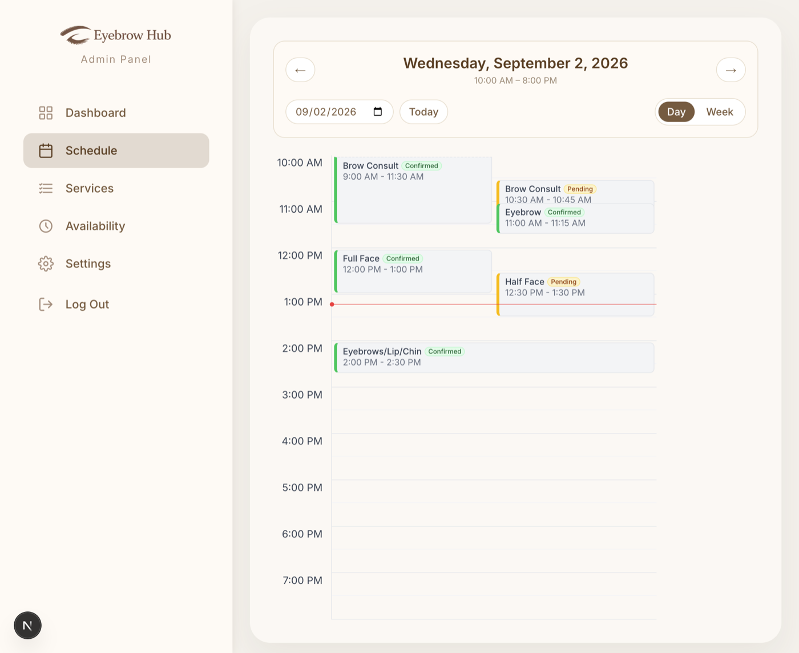

# Day Schedule Rebuild

**DT-463 · Staff day-schedule view**

What changed across twenty commits, where each change lives in the code, and why it was necessary.

`branch DT-465` · `20 commits` · `25 files` · `3 subtasks` · `+1,980 / −664 lines`

---

## What was asked for

One story, three subtasks. Staff needed a focused daily view instead of scanning a full week.

| Subtask | Goal |
| --- | --- |
| **DT-465** | Navigate between days, and show only business hours. |
| **DT-466** | Put appointments and blocked time at the right place and size. |
| **DT-467** | Use real data, work on a phone, handle loading and errors. |

All three are delivered. The rest of this document explains what stood in the way.

---

## Where we started

Most of the work below only makes sense against the starting state. `/admin/schedule` already
existed, but it was a prototype:

- A **weekly** grid with 24 rows, midnight to midnight — the opposite of a focused day.
- It ran on **invented appointments** named "Test Customer", booked for "Lash Lift" and "Brow Tint".
- A flag forced **fake blocked time** onto the screen even when the real API succeeded.
- Business hours were hardcoded in **three separate places that disagreed with each other**.
- There was **no loading state and no empty state**. A failed request quietly showed fake data instead.
- The admin panel was **unusable on a phone**, and no single page could fix it.
- The database seed created **zero appointments** — which turned out to be the root cause of the fake data.

---

## Foundation: one source of truth

**DT-465**

Before the day view could be built, three pieces of shared knowledge had to exist in exactly one
place each. This is the least visible work in the branch and the reason everything after it is
short.

### Business hours

The acceptance criterion says the schedule must begin and end according to hours *returned by the
API* — and there was no such API. Worse, the three hardcoded copies contradicted one another: the
admin editor showed Monday as 8:00–19:00 while the booking engine enforced 10:00–20:00. Staff could
edit hours on a screen that changed nothing.

Hours now live in `lib/businessHours.ts:17` and are served from a new endpoint at
`app/api/business-hours/route.ts:6`. The booking engine, the public website and the admin editor all
read from that one file.

<details>
<summary><b>Technical detail</b></summary>

The endpoint returns all seven days rather than one, so the schedule fetches once instead of
refetching every time you change date. A day missing from the map reports `closed: true`, preserving
the slot generator's previous behaviour of returning no bookable times while letting the grid render
a proper closed-day state.

Verified the change was invisible where it should be: the public site still renders
"10:00 am – 8:00 pm" Monday–Saturday and "11:00 am – 6:00 pm" Sunday, byte-identical to the old
hardcoded array.

</details>

### Dates, status, and overlap

Three more shared modules: `lib/dateUtils.ts` for local-time date handling,
`lib/appointmentStatus.ts` for what counts as cancelled, and `lib/scheduleLayout.ts` for placing
overlapping appointments side by side.

<details>
<summary><b>Technical detail</b></summary>

**Why local time.** Everything works in the browser's local time on purpose. The grid and the
availability engine both think in wall-clock time, and `toISOString()` would shift the date across
the UTC boundary — a 9 PM appointment would land on the wrong day.

**Rejecting impossible dates.** `lib/dateUtils.ts:22` validates the URL's date and round-trips it,
because JavaScript silently accepts `2026-02-31` and hands back March 3rd. Without that check an
invalid link renders a plausible but wrong day rather than falling back to today.

```ts
const roundTripped =
  parsed.getFullYear() === year &&
  parsed.getMonth() === month - 1 &&
  parsed.getDate() === day;

return roundTripped ? parsed : null;
```

**Overlap packing** at `lib/scheduleLayout.ts:30` sweeps items in start order, groups them into
clusters that overlap, and assigns each a column. Items in a cluster share a column count so their
edges line up, and back-to-back appointments are not treated as overlapping — otherwise a normal run
of bookings would be needlessly halved in width.

</details>

---

## The day view itself

**DT-465**

The grid now renders only the hours the salon is open — ten rows on a weekday, seven on a Sunday —
and every control (previous, next, the date picker, Today) writes to the URL.

**Why the URL matters.** Holding the selected date in the address bar rather than in component
memory is what makes "open the schedule from the dashboard with a date in the link" work with no
extra plumbing. It also means a day can be bookmarked, shared with a colleague, and survives a page
refresh.

<details>
<summary><b>Technical detail</b></summary>

**The date is memoised** on the raw query string at `app/admin/(panel)/schedule/page.tsx:42`.
Deriving a `Date` on every render would hand the data-fetching effect a brand-new object each time
and re-run it in a loop.

**A Suspense boundary is mandatory**, not stylistic — `schedule/page.tsx:198`. Reading URL
parameters in a Next.js client component fails the production build outright without one. This was
verified by running a real `npm run build`, not assumed.

**Positioning is proportional, not bucketed** —
`components/admin/schedule/DayScheduleGrid.tsx:64`. An item's offset and height come from its actual
start and duration, so a 10:30 booking sits halfway down the 10 AM row rather than at its top. Row
height lives in a CSS variable so rows and cards rescale together across screen sizes with no
JavaScript measurement.

</details>

---

## Four real bugs found along the way

**DT-466**

These were not in the ticket. Each was found while building, and each would have shown staff
something untrue.

### 1. Cancelled appointments appeared on the schedule

> **Severity:** wrong data shown

A cancelled booking still drew on the grid, so staff would see work that was not happening. Fixed at
`app/api/admin/appointments/route.ts:52`.

**Why the obvious fix was not enough.** The natural approach is a database filter — "give me
everything where status is not cancelled". That silently fails here, because `status` is a free-text
column with nothing constraining what goes into it. A row saved as `"Cancelled"` with a capital C
does not equal `"cancelled"`, and would have gone straight through onto the schedule.

<details>
<summary><b>Technical detail</b></summary>

The filter runs in application code through a shared helper that normalises case and whitespace and
accepts both the British and American spellings — `lib/appointmentStatus.ts:17`:

```ts
export function isCancelled(status: string | null | undefined): boolean {
  const value = normalize(status);
  return value === CANCELLED_STATUS || value === "canceled";
}
```

This was proven rather than assumed: a test row was written to the database as `"Cancelled"`,
confirmed absent from both the API response and the rendered grid, then deleted.

</details>

### 2. Appointments crossing the day boundary disappeared

> **Severity:** missing data

Both schedule endpoints asked only "does this appointment *start* inside the day?". An appointment
running from 11:30 PM into 12:30 AM therefore vanished from the day it ran into. Fixed at
`app/api/admin/appointments/route.ts:38-39` and `app/api/admin/availability-blocks/route.ts:34-35`.

This barely mattered for a week-long window. For a single day it matters a great deal, because a day
has two boundaries and far more chance of something straddling one.

<details>
<summary><b>Technical detail</b></summary>

The query changes from containment to true overlap:

```diff
- startTime: { gte: startDate, lt: endDate }
+ startTime: { lt: endDate },
+ endTime:   { gt: startDate },
```

Verified against a real row running 23:30 → 00:30, which the previous filter missed entirely and the
new one returns.

</details>

### 3. The weekly grid could draw an appointment in the wrong week

> **Severity:** wrong placement

The weekly view decided which column an appointment belonged in by looking at its *weekday only* —
"it's a Saturday, put it in the Saturday column" — without checking the actual date. Fixed at
`components/admin/schedule/WeekScheduleGrid.tsx:33-39`.

**The interesting part:** this bug was harmless until the previous fix made it reachable. Once the
query started returning items that overlap the window, an appointment from Saturday 29 August came
back for the 30 August–5 September week and was drawn on **Saturday 5 September — six days from when
it actually happens**.

<details>
<summary><b>Technical detail</b></summary>

Rather than assert this, the old predicate was run against the live data in the browser and asked
which items it would place differently. It named exactly one:

```
Edge Case -> old: rendered in Sat Sep 05 2026,
             new: hidden (actual date Sat Aug 29 2026)
```

The lesson worth presenting: fixing one bug can wake another. The two fixes are separate commits
precisely so this relationship is visible in the history.

</details>

### 4. Short appointments had their time squashed, not clipped

> **Severity:** unreadable

On a 15-minute booking the time underneath the service name was unreadable. The obvious diagnosis —
the text overflows its box — was wrong, and the first fix based on that diagnosis appeared to work
while the text was still broken.

**What was actually happening:** the card is a flexible column, and flexible children *compress* to
fit rather than overflow. The browser reported no overflow at all, because there was none. The time
line was being rendered **9 pixels tall against a natural 15** — the glyphs were being crushed.

<details>
<summary><b>Technical detail</b></summary>

The standard overflow check gave a false all-clear:

```
h=34  scroll=32/client=32  overflow=false  timeLineH=9   ← squashed
h=92  scroll=90/client=90  overflow=false  timeLineH=15  ← natural
```

The fix marks both text lines as non-shrinkable and raises the card's minimum height to fit them at
natural size — `DayScheduleGrid.tsx:20` and `ScheduleItemBlock.tsx:75,88`. Every card now measures a
consistent 15px time line on desktop and 13px on mobile.

Worth noting as a method point: measuring the *symptom* the user described, rather than the property
that seemed related, is what found this.

</details>

---

## Removing the invented data

**DT-467**

The criterion reads "mock appointment and availability data is not used in production". Deleting the
fake data was the easy half; the reason it existed was the real problem.

**The seed file created no appointments at all.** Only services and stylists. So a freshly set-up
database gave a completely empty schedule, and someone had reasonably reached for fake rows to
develop against. Deleting them without fixing that would just have swapped fake data for a blank
screen.

The seed now creates demo appointments and blocked time anchored to today — `prisma/seed.js:84-147`
— deliberately chosen to cover every acceptance criterion: a 15-minute booking, an overlapping pair,
a cancelled row that must stay hidden, and one starting before opening to prove the grid clamps it.

<details>
<summary><b>Technical detail</b></summary>

**Re-running replaces rather than accumulates.** Appointments are tagged in their notes field.
Blocked time has no field to tag and includes one deliberately blank reason to cover that display
path, so it is cleaned up by date window instead. Verified idempotent across three consecutive runs
— counts held at 15 appointments and 3 blocks, with pre-existing real bookings untouched.

**A missing migration was also found.** The `Stylist` table is defined in the schema but appears in
no migration, so a database built from migrations alone has no such table: the seed throws and the
stylists endpoint returns a 500. Added at `prisma/migrations/20260902120000_add_stylist_table/`,
guarded so it is a no-op on existing environments that already have the table.

</details>

### Honest states instead of invented ones

The old page answered a failed request with fabricated appointments. That is worse than showing
nothing, because staff had no way to tell invented rows from real ones. There are now three states
that differ in *shape*, not just wording, so they are not distinguished by colour alone —
`components/admin/schedule/ScheduleStates.tsx`.

<details>
<summary><b>Technical detail</b></summary>

**Loading** is a pulsing skeleton announced politely to screen readers. **Empty** is a neutral
message over a drawn grid — deliberately not red, so it never reads as a failure. **Error** is a red
panel with a working "Try again" button, the first retry affordance anywhere in the codebase.

All three were verified in a real browser: throttled to slow 3G the skeleton holds and is announced;
a far-future date gives the empty state; blocking the endpoint at the network layer produces the
error with *no* invented rows, and the retry recovers to the real eight items.

</details>

---

## Making the admin panel work on a phone

**DT-467**

This was the largest single obstacle, and it was not in the schedule page at all.

The admin layout put a fixed 320-pixel sidebar next to the content inside a container that clipped
anything overflowing. On a 375-pixel phone that left **55 pixels of content — which could not even
be scrolled to**. No amount of work on the schedule page could have fixed this, because the page was
never given room to exist.

Below large screens the sidebar is now a drawer behind a menu button, and the content column is
allowed to shrink — `app/admin/(panel)/layout.tsx:211-235`. Content is now the full 375 pixels on
*all five* admin pages. This one change touches every admin screen.

<details>
<summary><b>Technical detail</b></summary>

The drawer closes on Escape, on tapping the backdrop, and on navigating — so it never covers the
page it just moved to. Closing on navigation is handled by the navigation's own callback rather than
by watching the URL, because closing is a consequence of the click, not state to reconcile
afterwards; the watching version is a cascading-render antipattern the project's linter rejects
outright.

**The weekly grid genuinely cannot fit seven columns at 375px.** It keeps a minimum width and
scrolls inside its own container, so the page itself never scrolls sideways — which is what the
criterion actually asks for. Day headings shorten to "Mon", "Tue" on narrow screens. This is the
first horizontal-scroll container in the codebase; the existing convention was truncation only,
which is not an option for a time grid.

</details>

---

## The dashboard now shows real numbers

**DT-467**

Every figure on the dashboard was hardcoded — the counts, two fictional booking requests named Lily
Oliver and Emily Smith, and a fixed four-row schedule. All of it is now real, via a single endpoint
at `app/api/admin/dashboard-summary/route.ts`.

**Why the browser sends the dates.** The day and week boundaries are calculated in the browser and
sent to the server, rather than the server working out what "today" means. In production the server
runs in UTC while the salon does not, so "today" has to mean the viewer's today —
`app/admin/(panel)/dashboard/page.tsx:162-169`.

**Why two buttons are switched off.** The approve and reject controls on booking requests are now
visibly disabled and labelled. There is no endpoint anywhere in the application that can change an
appointment, so wiring them was impossible; leaving them looking live would imply an action that
silently does nothing.

---

## Design and accessibility

**DT-466**

### What you can see

A coloured left edge on each card carries its status — green confirmed, amber pending — which
survives truncation, so status stays readable in a column too narrow for the badge label. A red line
marks the current time when you are looking at today. Lighter rules at the half hour let you read a
12:30 start off the grid instead of inferring it. The day view borrows the weekly view's palette and
type so the two read as one product.

### What you cannot see

Appointments and blocked time are drawn at absolute positions, which carries no reading order — a
screen reader would have heard every blocked period and then every appointment, rather than the day
in sequence. They are now emitted in chronological order with layering handled purely in CSS, so the
same markup serves both — `DayScheduleGrid.tsx:174`. Cards also gained visible focus outlines; they
were already keyboard-reachable buttons that gave no sign of being focused.

<details>
<summary><b>Technical detail</b></summary>

The current-time marker reads the clock through a subscription rather than an effect —
`DayScheduleGrid.tsx:95`. This keeps it out of the server-rendered HTML, which matters because a
clock rendered on the server disagrees with the browser a moment later and breaks hydration. It also
avoids the same lint rule that the drawer fix ran into.

Verified at four times of day with the clock frozen: 2:00 PM lands at 256px and 10:30 AM at 32px —
both exact — and the marker is correctly absent before opening and after closing.

</details>

---

## How all of this was verified

The project has no test framework — the README defers that to a later sprint — so every claim here
was measured in a real browser instead of asserted.

Chrome was driven directly over its debugging protocol using the WebSocket built into Node 22, so
**no testing library was added to the project** to do it. Grid geometry was additionally checked by
rendering the components to HTML on their own. The layout, date and status modules were written as
pure functions specifically so a proper test suite can be added later without rewriting them.

| What | Before | After | Why it matters |
| --- | --- | --- | --- |
| Content width at 375px | `55px` | `375px` | Panel was unusable on a phone |
| Time line on a short card | `9px` | `15px` | Text was being crushed, not clipped |
| Copies of business hours | `3` | `1` | The three disagreed with each other |
| Appointments in the seed | `0` | `9` | Root cause of the invented data |
| 10:30 booking position | `row top` | `32px in` | Half way down a 64px hour row |
| Overlapping pair width | `stacked` | `50% / 50%` | Both are now readable |



*The finished day view, on real seeded data. The grid runs 10:00 AM to 8:00 PM because that is what
the business-hours API returns for a Wednesday. Green and amber left edges carry status; the 12:00
and 12:30 bookings share the width rather than stacking; the 9:00 appointment is clipped at the top
because it starts before opening; and the red line is the current time, captured with the clock held
at 1:10 PM so the marker is visible. A cancelled booking exists at 3:00 PM on this day and is
correctly absent.*

---

## The twenty commits

Each commit is one idea and explains its own reasoning, so the history is reviewable a step at a
time rather than as one large drop.

| SHA | Change |
| --- | --- |
| `145f3f3` | Shared business hours module and API |
| `0142ead` | Shared local-time date utilities |
| `b7f4a36` | Appointment status helpers |
| `7a4dfcd` | Overlap layout helper |
| `c2adf83` | Reuse shared business hours in existing views |
| `20dcca5` | Reuse shared date helper in booking flow |
| `e9b1c3f` | Screen-reader-only utility |
| `c0c0999` | Extract schedule types and grid |
| `93d455a` | Business-hour day grid |
| `2e5383b` | Drive date and view from the URL |
| `467c603` | Link the dashboard to the day schedule |
| `3c2ec4c` | Exclude cancelled and fix the query window |
| `bc59d27` | Place week items by date, not weekday |
| `000b444` | Show status, blocked time and overlaps |
| `aef274a` | Add the missing Stylist migration |
| `cd6abae` | Seed demo appointments and blocked time |
| `d7f3672` | Remove mock data, add real states |
| `e6ac05b` | Make the admin panel usable at 375px |
| `029414e` | Replace dashboard mock data with real data |
| `ca83ee1` | Refine and polish the day grid |

<details>
<summary><b>Technical detail</b></summary>

The history was tidied from 22 commits to 20 by folding two self-corrections into the commits they
corrected. The rewrite was confirmed safe rather than trusted: the repository's **tree hash is
identical before and after**, and a diff against the pre-rewrite branch is empty. Same code, cleaner
history.

</details>

---

## Known gaps and future work

Found during this work, deliberately left out of scope. Each deserves its own ticket.

**The admin API endpoints have no authentication.**
The route guard covers admin *pages* but not the `/api/admin/*` endpoints beneath them, so
appointment and customer data is readable without logging in. The guard also only checks that a
login cookie is non-empty; it never validates it. This is the most important item on this list.

**Server and salon timezones can disagree.**
Hosted in production the server runs in UTC while the salon does not. The schedule and dashboard
work around this by sending boundaries from the browser, but the underlying booking engine still
reasons in server time. A short-term mitigation is a timezone setting on the host; the proper fix is
an explicit salon timezone.

**Appointments are not assigned to a stylist.**
The database has no link between an appointment and a stylist — the booking flow collects a
preference and discards it. So this is a salon-wide schedule, not a per-staff one. A true per-staff
view needs a schema change.

**Nothing can change an appointment yet.**
There is no endpoint to approve, reject, reschedule or cancel. This is why the dashboard's approve
and reject buttons are disabled, and it is the natural next story.

**The availability screen still saves nothing.**
Business hours and blocked times edited there live only in the browser. It now opens on the real
hours, so it no longer misleads, but changes still do not persist.

**Seeded blocked time is visibly labelled "[demo]".**
A deliberate trade-off: the marker is what lets the seed clean up its own rows without risking real
ones. It can be removed if demo data needs to look production-clean.

---

*DT-463 · Staff day-schedule view · branch `DT-465` · 20 commits · build, typecheck and lint passing*
